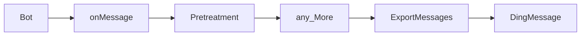
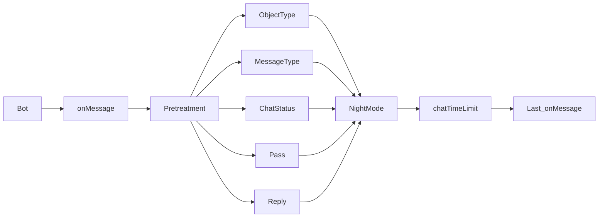

## Go-Wechaty-Bot-Plugin

- [Go-Wechaty-Bot](https://github.com/XRSec/Go-Wechaty-Bot)
- [Go-Wechaty-Bot-XP](https://github.com/XRSec/Go-Wechaty-Bot-XP)

### Add Features

```ini
.
├── Admin
│    └── Admin.go
```

```go
package Admin

import (
	"fmt"
	. "github.com/XRSec/Go-Wechaty-Bot/General"
	. "github.com/XRSec/Go-Wechaty-Bot/Plug"
	"github.com/wechaty/go-wechaty/wechaty"
	"github.com/wechaty/go-wechaty/wechaty-puppet/schemas"
	"github.com/wechaty/go-wechaty/wechaty/user"
)

var (
	err error
)

const name = "Admin"

func New() *wechaty.Plugin {
	plug := wechaty.NewPlugin()
	plug.OnMessage(onMessage)
	return plug
}

func onMessage(context *wechaty.Context, message *user.Message) {
	m, ok := (context.GetData("msgInfo")).(MessageInfo)
	if !ok {
		fmt.Println()
		return
	}

	fmt.Println(message.Text())

	if m.Status {
		fmt.Println("Room")
		m.PassResult = fmt.Sprintf("Is Room: [%v]", m.RoomName)
		m.Pass = true
		goto end
	} else {
		fmt.Println("Friend")
	}

end:
	context.SetData("msgInfo", m)
}
```

### PreProcessing

- Server/General/Pretreatment.go
- Server/main -> main_Bot.Use (from top to bottom)



### LogicalProcessing

- Server/General/Pretreatment.go


